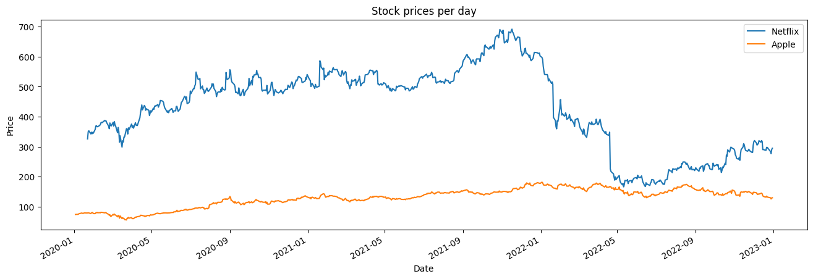
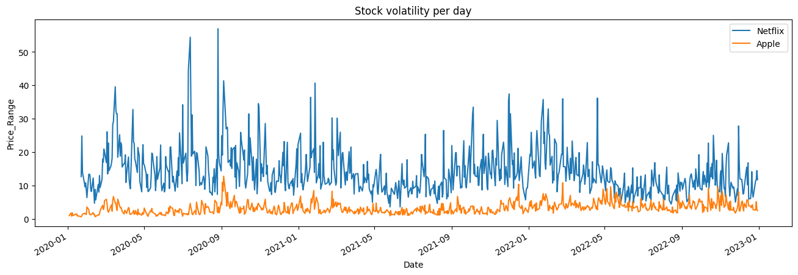

## stock performance modeling
Hello every one. I am new to finance and I am `so far` realy enjoying myself here. In this module I decided again to model what i am learning into code because I foud that is the best way I can internalize concepts. This python code can be used to compute performance of securities based on what I leant in lesson 3 of this module. The class is called stock performance but it can be tailored to work with bonds or even cryptocurrencies. The only catch is you should have reliable data.

```
import math
import pandas as pd

class StockPerformance:
    """
    class for measuring perfomance of securities
    """

    def __init__(self, data: pd.DataFrame) -> None:
        self.data: pd.DataFrame = data
        self.volatility: float = None
        self.performance_data: pd.DataFrame = None
        
        self.compute_performance()

    def percent_return(self, price_t1: float, price_t2: float):
        """
        return received at t2 for each dollar invested at t1
        """
        return (price_t2-price_t1)/price_t1

    def log_return(self, price_t1: float, price_t2: float):
        """
        I think the difference is not taken here because it could result to 0
        """
        return math.log(price_t2/price_t1)


    def compute_volatility(self, price_series_data: pd.Series):
        """
        """
        return price_series_data.std()

    def daily_price_range(high: float, low: float):
        """
        """
        return high-low

    def coefficient_of_variation(self, the_return: float):
        """
        """
        return the_return*100/self.volatility

    def sharpe_ratio(self, the_return: float):
        """
        """
        return self.volatility/(the_return*100)

    def compute_performance(self):
        """
        combining all the above functions
        """
        self.performance_data = self.data.copy()
        self.performance_data['Price_t_minus_1'] = self.performance_data['Price'].shift()
        self.performance_data.dropna(inplace=True)
        
        self.performance_data['percent_return'] = self.performance_data.apply(
            lambda row: self.percent_return(row['Price_t_minus_1'], row['Price']),
            axis=1
        )
        self.performance_data['log_return'] = self.performance_data.apply(
            lambda row: self.log_return(row['Price_t_minus_1'], row['Price']),
            axis=1
        )
        
        
        self.volatility = self.compute_volatility(self.performance_data['Price'])
        
        self.performance_data['Price_Range'] = self.performance_data['High']\
            - self.performance_data['Low']
        
        self.performance_data['coefficient_of_variation'] = self.performance_data['percent_return']\
        .apply(
            self.coefficient_of_variation
        )
        
        self.performance_data['sharpe_ratio'] = self.performance_data['percent_return']\
        .apply(
            self.sharpe_ratio
        )
        
        self.performance_data.drop(columns=['Change %', 'Open'], inplace=True)
```

## concerns
While I was writing this code I got the following concerns which I would love to get clarified.
1. why is the return metric called percent return when in the formula the ratio is not multiplied by 100? I mean:

why:
$$
Percent\ Return=(Price_{time2}-Price_{time1})/Price_{time1}
$$
and not

$$
Percent\ Return=(Price_{time2}-Price_{time1})*100/Price_{time1}
$$
I think the naming of the metric is kind of misleading.

2. The `Sharpe Ratio` and  `The Coefficient of Variation` are both calculated from percent return. Could they be calculated from log return?

## usage

I downloaded apple and netflix stock price data from https://www.investing.com/ to run the following simulation with the class above:
```
import pandas as pd
import matplotlib.pyplot as plt
from stock_performance import StockPerformance
```
Importing and tranforming netflix data
```
netflix_data = pd.read_csv('NFLX Historical Data.csv')
netflix_data['Date'] = pd.to_datetime(netflix_data['Date'])
netflix_data.sort_values(by='Date', ascending=True, inplace=True)
netflix_data.set_index('Date', inplace=True)
netflix = StockPerformance(netflix_data)
```
doing the same for apple
```
apple_data = pd.read_csv('AAPL Historical Data.csv')
apple_data['Date'] = pd.to_datetime(apple_data['Date'])
apple_data.sort_values(by='Date', ascending=True, inplace=True)
apple_data.set_index('Date', inplace=True)
apple = StockPerformance(apple_data)
```
stock visual
```
fig, ax = plt.subplots(figsize=(16, 5))
netflix.performance_data['Price'].plot(ax=ax, xlabel='Date', ylabel='Price', title='Stock prices per day');
apple.performance_data['Price'].plot(ax=ax)
plt.legend(['Netflix', 'Apple']);
```

volatility visual
```
fig, ax = plt.subplots(figsize=(16, 5))
netflix.performance_data['Price_Range'].plot(ax=ax, xlabel='Date', ylabel='Price_Range', title='Stock volatility per day');
apple.performance_data['Price_Range'].plot(ax=ax)
plt.legend(['Netflix', 'Apple']);
```

I was short in time but I believe more can be done with the code to suit any performance technical analysis. I also know that more simulations can be done with that class.